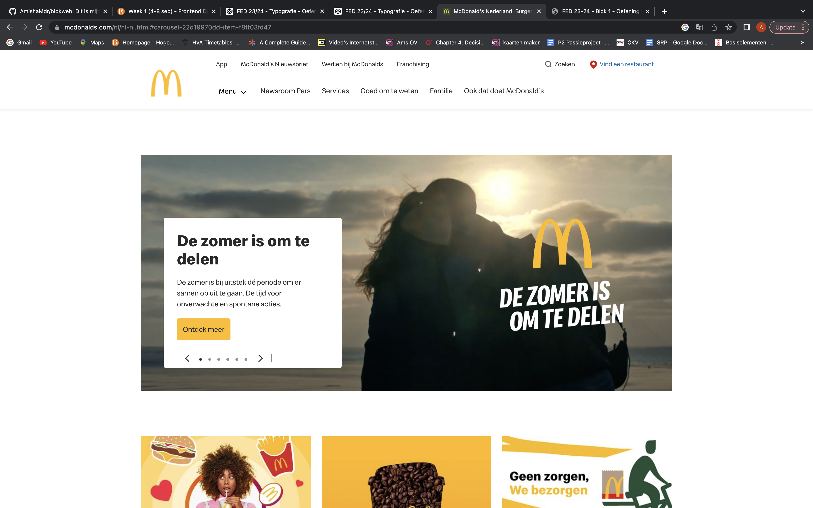
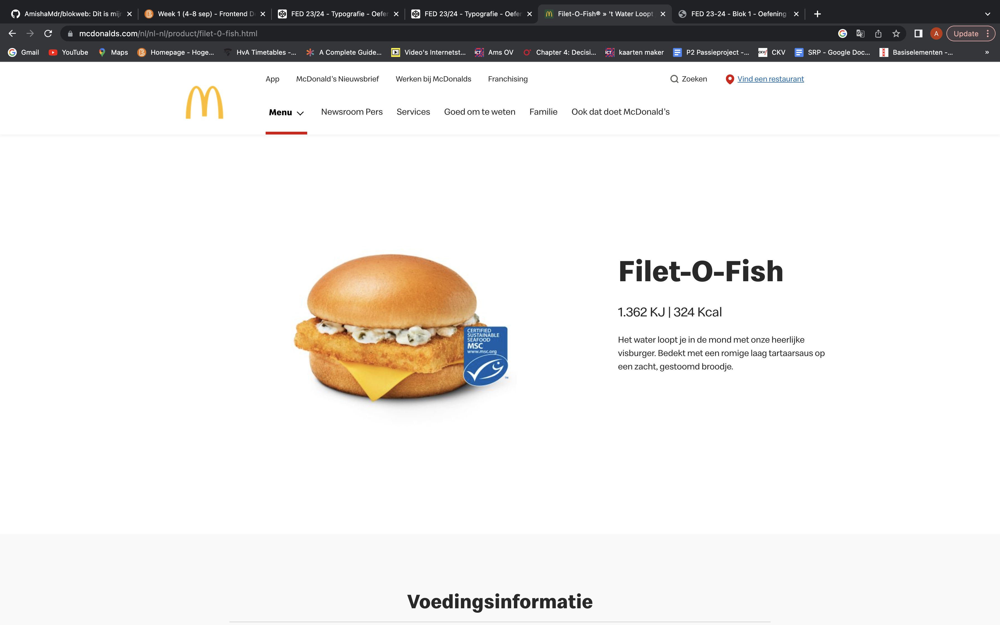

# Procesverslag

Markdown is een simpele manier om HTML te schrijven.  
Markdown cheat cheet: [Hulp bij het schrijven van Markdown](https://github.com/adam-p/markdown-here/wiki/Markdown-Cheatsheet).

Nb. De standaardstructuur en de spartaanse opmaak van de README.md zijn helemaal prima. Het gaat om de inhoud van je procesverslag. Besteedt de tijd voor pracht en praal aan je website.

Nb. Door _open_ toe te voegen aan een _details_ element kun je deze standaard open zetten. Fijn om dat steeds voor de relevante stuk(ken) te doen.

## Jij

  
uitwerken voor kick-off werkgroep

### Auteur:

Amisha Madarie

#### Je startniveau:

blauw

#### Je focus:

responsive

## Je website

  
uitwerken voor kick-off werkgroep

### Je opdracht:

link naar de website die ik ga namaken: (https://www.mcdonalds.com/nl/nl-nl/full-menu.html)

#### Screenshot(s) van de eerste pagina (small screen):

hier de naam van de pagina  
 

#### Screenshot(s) van de tweede pagina (small screen):

hier de naam van de pagina  
 

## Toegankelijkheidstest 1/2 (week 1)

  
uitwerken na test in 2e werkgroep

### Bevindingen

Lijst met je bevindingen die in de test naar voren kwamen:

  <ul>   
   <li>Bij de foto sliders geeft het aan per tab welke van de 6 het is, maar het geeft niet aan wat er staat per tab zodat je de juiste tab kiest.</li>
   <li>Het gaat alle menu onderdelen af van secondary tot main navigation.</li>
   <li>Je kan niet makkelijk een andere deel laten voorlezen met de screenreader als je het al gezien hebt.</li>
   <li>Je kan niet op plaatjes of tekst klikken om te kijken wat het is.</li>
   <li>Je moet de shortcuts weten om makkelijk te kunnen navigeren.</li>
   <li>Shortcuts zijn niet makkelijk te gebruiken.</li>
  </ul>

## Breakdownschets (week 1)

  
uitwerken na afloop 3e werkgroep

### de hele pagina:

  

### dynamisch deel (bijv menu):

  

### wellicht nog een dynamisch deel (bijv filter):

  

## Voortgang 1 (week 2)

  
uitwerken voor 1e voortgang

### Stand van zaken

hier dit ging goed & dit was lastig (neem ook screenshots op van delen van je website en code)

Ik vond de elementen aanspreken zonder classes en id lastig. Ik ken geen andere selectoren dus dat ga ik nog navragen.
Alle content in mijn html zetten ging wel goed. Verder ken ik qua css niet veel over grid, layout etc dus daar ga ik mee oefenen.

### Agenda voor meeting

samen met je groepje opstellen

(Hebben we niet gedaan.)

| student 1      | student 2          | student 3    | student 4        |
| -------------- | ------------------ | ------------ | ---------------- |
| dit bespreken  | en dit             | en ik dit    | en dan ik dat    |
| en dat ook nog | dit als er tijd is | nog een punt | dit wil ik zeker |
| ...            | ...                | ...          | ...              |

### Verslag van meeting

hier na afloop snel de uitkomsten van de meeting vastleggen

- Gebruik end of type en andere selectoren. Eventueel css diner als je het lastig vindt.
- Gebruik root voor herhalende kleuren of font etc.
- Gebruik sections en flexbox om elementen naast elkaar te plaatsen.
- Gebruik grid.

## Voortgang 2 (week 3)

  
uitwerken voor 2e voortgang

### Stand van zaken

hier dit ging goed & dit was lastig (neem ook screenshots op van delen van je website en code)

### Agenda voor meeting

samen met je groepje opstellen

| student 1      | student 2          | student 3    | student 4        |
| -------------- | ------------------ | ------------ | ---------------- |
| dit bespreken  | en dit             | en ik dit    | en dan ik dat    |
| en dat ook nog | dit als er tijd is | nog een punt | dit wil ik zeker |
| ...            | ...                | ...          | ...              |

### Verslag van meeting

hier na afloop snel de uitkomsten van de meeting vastleggen

- punt 1
- punt 2
- nog een punt
- ...

## Toegankelijkheidstest 2/2 (week 4)

  
uitwerken na test in 9e werkgroep

### Bevindingen

Lijst met je bevindingen die in de test naar voren kwamen (geef ook aan wat er verbeterd is):

## Voortgang 3 (week 4)

  
uitwerken voor 3e voortgang

### Stand van zaken

hier dit ging goed & dit was lastig (neem ook screenshots op van delen van je website en code)

### Agenda voor meeting

samen met je groepje opstellen

| student 1      | student 2          | student 3    | student 4        |
| -------------- | ------------------ | ------------ | ---------------- |
| dit bespreken  | en dit             | en ik dit    | en dan ik dat    |
| en dat ook nog | dit als er tijd is | nog een punt | dit wil ik zeker |
| ...            | ...                | ...          | ...              |

### Verslag van meeting

hier na afloop snel de uitkomsten van de meeting vastleggen

- punt 1
- punt 2
- nog een punt
- ...

## Eindgesprek (week 5)

  
uitwerken voor eindgesprek

### Je uitkomst - karakteristiek screenshots:

  

### Dit ging goed/Heb ik geleerd:

Korte omschrijving met plaatjes

  

### Dit was lastig/Is niet gelukt:

Korte omschrijving met plaatjes

  

## Bronnenlijst

  
continu bijhouden terwijl je werkt

Nb. Wees specifiek ('css-tricks' als bron is bijv. niet specifiek genoeg).
Nb. ChatGpT en andere AI horen er ook bij.
Nb. Vermeld de bronnen ook in je code.

1. bron 1
2. bron 2
3. ...

