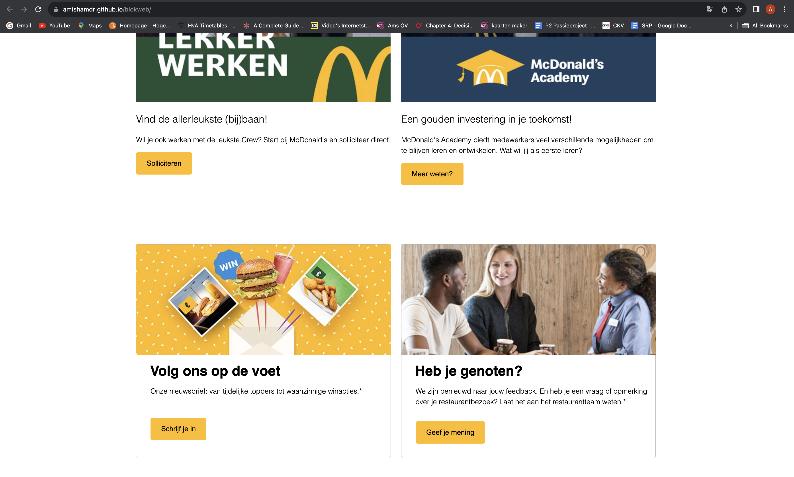
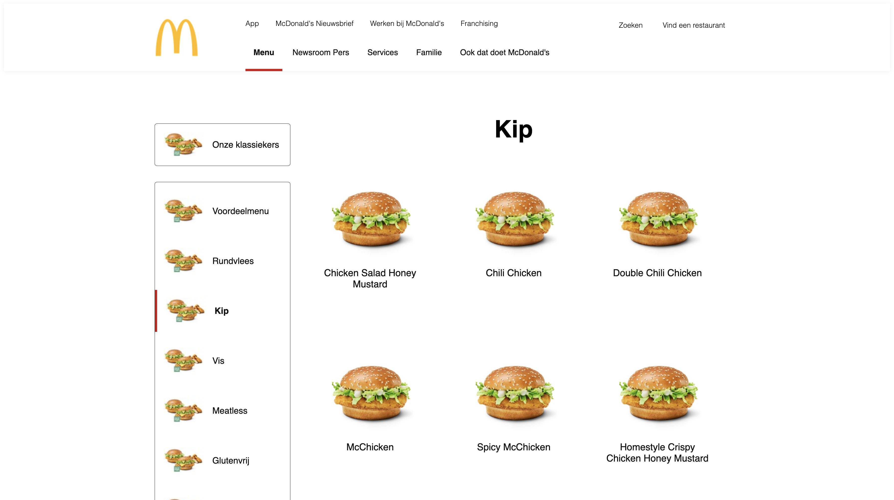

# Procesverslag

Markdown is een simpele manier om HTML te schrijven.  
Markdown cheat cheet: [Hulp bij het schrijven van Markdown](https://github.com/adam-p/markdown-here/wiki/Markdown-Cheatsheet).

Nb. De standaardstructuur en de spartaanse opmaak van de README.md zijn helemaal prima. Het gaat om de inhoud van je procesverslag. Besteedt de tijd voor pracht en praal aan je website.

Nb. Door _open_ toe te voegen aan een _details_ element kun je deze standaard open zetten. Fijn om dat steeds voor de relevante stuk(ken) te doen.

## Jij

  
uitwerken voor kick-off werkgroep

### Auteur:

Amisha Madarie

#### Je startniveau:

blauw

#### Je focus:

responsive

## Je website

  
uitwerken voor kick-off werkgroep

### Je opdracht:

link naar de website die ik ga namaken: (https://www.mcdonalds.com/nl/nl-nl/full-menu.html)

#### Screenshot(s) van de eerste pagina (small screen):

Homepagina McDonald's

 

#### Screenshot(s) van de tweede pagina (small screen):

Menu pagina McDonald's

 

## Mijn proces

  
Proces van mijn website

### Homepage:

 

Dit is mijn homepagina tot nu toe. Dit is content wat ik erin heb gezet en ik ga daarna aan de slag met vormgeving css.
Ik heb hier al een grid toegepast voor mijn header in 3 delen waardoor het mooi naast elkaar staat. 
Ik heb dit gedaan met behulp van de studentassistent. Ik vond dit zelf nog te lastig om te doen. 
Verder heb ik hier al de buttons vormgegeven. 

### Carousel afbeelding 1:

 

Hier had ik een poging gedaan tot vormgeving voor de eerste slide van de carousel. 
Het was lastig om uit te vogelen hoe je de lagen op elkaar krijgt.
Er zijn veel verschillende manieren om dit te doen dus ik moest navragen hoe ik dit precies moest doen.
Ik heb dit uiteindelijk met een grid gedaan. Het was erg lastig maar met wat hulp kwam ik er wel.
Door met grid te werken begrijp ik wat beter hoe het werkt.

### Carousel afbeelding en homepage:

 

Hier heb ik gewerkt aan de vormgeving van de hele pagina. De header ziet er al netter uit en je ziet weer de afbeelding met tekst erop.
Ik heb de artikelen eronder precies dezelfde grid gegeven zodat het precies onder elkaar kan staan.
Ik moest nog wel spelen met de gap tussen de artikelen maar dat was wel gelukt. 
Met grid werken is niet echt makkelijk, maar het ziet er wel goed uit als je het eenmaal doorhebt.

### Onderkant homepage:

 

Hier zie je nogmaals het grid wat ik heb gemaakt. Elke rij met artikelen waren net ietsje anders niet heel erg anders.
Het is erg vergelijkbaar met de McDonald's site door de grid dus dat is erg goed gelukt.
Ik ben zelf wel blij met het resultaat

### footer homepage:

 

Ik vind dat de footer super goed gelukt is. De layout is precies hoe ik het wil.
Ik heb ook geleerd hoe je werkt met nth of type waardoor ik de eerste li uit de ul kon aanspreken.
Dat zou me eerst nooit lukken dus daar ben ik blij mee.
Het ziet er naar mijn mening uit zoals op de McDonald's site dus daar ga ik niet meer aan zitten.

### Menu pagina:

 

Ik heb zoals bij de eerste pagina eerst mijn content erin gezet voordat ik css aanpas. 
Ik heb een apart css bestand aangemaakt om overzicht te houden.
Ik had na mijn feedback begrepen dat deze pagina te weinig elementen heeft dus ik ga de menu pagina maken.
Deze heeft een interessantere layout dan de details pagina omdat er vrij weinig te zien is.

### Navigatie pagina:

 
  
   
    

Ik ging hierna door met de navigatie wat je kan zien in de afbeeldingen.
Om het precies zo na te maken was wel een ding omdat ik nog niet goed ben met flexbox en grid.
Ik wist niet eens dat je die twee kon combineren. Ik vroeg om hulp en daarna lukte het wel.
Ik begrijp nu veel beter hoe flexbox werkt en hoe je grid kan combineren met flexbox.

### Rode lijn:

 
  

Ik wilde de rode lijn zowel voor mijn navigatie als voor mijn header.
Ik wist nog niet precies hoe je de lengte goed kreeg en precies op de onderste border kreeg. 
Dit is uiteindelijk wel gelukt. Het maakt de pagina wel duidelijker en af.

### Menu items:

 

Ik ging door naar de items op het menu. Ik vond het nog lastig om grid te gebruiken 
en ik wist niet hoe je naast flexbox navigatie uberhaupt nog grid kon gebruiken.
Ik heb dit uiteindelijk toch kunne doen met flexbox en het is gelukt zoals ik dat wilde.

### Resultaat menu pagina:

 

Dit is de hele menu pagina geworden. 
Ik heb afbeeldingen hergebruikt zodat ik het sneller kan uploaden naar github.
Ik ben er tevreden mee. 
Eerlijk gezegd vergeet ik snel wat ik precies gedaan heb om dingen te bereiken nadat ik het gedaan heb, 
maar ik kan altijd nog terug kijken om het opnieuw te doen.
Dat is het lastige aan coderen voor mij nadat ik het doe ben ik vergeten wat ik gedaan heb.

### Accesability verbeteren:

 
  

Ik moest mijn accessability verbeteren omdat h4 hidden niet werkte.
Je ziet het niet, maar het wordt ook niet voorgelezen door de screenreader en daar hebben we dus niks aan. 
Niks anders werkte en ik wist niet hoe ik dit moest aanpakken. 
Een klasgenoot zei toen iets in de richting van 
'Ik weet niet of dit correct is maar je kan ook gewoon de tekst wit maken en dan wordt het sowieso voorgelezen.'
Ik vond dit niet eens zo'n slecht idee dus dat is dan ook wat ik heb geprobeerd. 
Eerst had ik het aan de kant gezet met margin maar hij sprong daar naartoe als de screenreader aan het lezen was en dat is niet goed.
Ik heb dus mijn tekst klein gemaakt en vervolgens wit gemaakt zodat het de layout niet verstoort en je het niet ziet.
Na de test met de screenreader was het voor mij duidelijk wat waar was en waarvoor knoppen en linkjes zijn.

### States:

 
  

Ik wilde nog states toevoegen om het echt af te maken.
Ik koos voor de rode onderlijning omdat dit past bij de site en ze gebruikte eerder al de rode lijnen wat we op de menu pagina zagen.
Ik vind dit er wel goed uitzien. 
De lijn is dichterbij de secundaire menu dan bij de main menu. Ik vind dat wel een leuk effect hebben.
Het heeft ook een animatie wat het interessanter maakt. Ik heb dit gekopieërd en aangepast van codepen via DLO.
Ik heb de code doorgenomen om te begrijpen wat er gebeurd. 

## Toegankelijkheidstest 1/2 (week 1)

  
uitwerken na test in 2e werkgroep

### Bevindingen

Lijst met je bevindingen die in de test naar voren kwamen:

  <ul>   
   <li>Bij de foto sliders geeft het aan per tab welke van de 6 het is, maar het geeft niet aan wat er staat per tab zodat je de juiste tab kiest.</li>
   <li>Het gaat alle menu onderdelen af van secondary tot main navigation.</li>
   <li>Je kan niet makkelijk een andere deel laten voorlezen met de screenreader als je het al gezien hebt.</li>
   <li>Je kan niet op plaatjes of tekst klikken om te kijken wat het is.</li>
   <li>Je moet de shortcuts weten om makkelijk te kunnen navigeren.</li>
   <li>Shortcuts zijn niet makkelijk te gebruiken.</li>
  </ul>

## Voortgang 1 (week 2)

  
uitwerken voor 1e voortgang

### Stand van zaken

hier dit ging goed & dit was lastig (neem ook screenshots op van delen van je website en code)

Ik vond de elementen aanspreken zonder classes en id lastig. Ik ken geen andere selectoren dus dat ga ik nog navragen.
Alle content in mijn html zetten ging wel goed. Verder ken ik qua css niet veel over grid, layout etc dus daar ga ik mee oefenen.

### Verslag van meeting

hier na afloop snel de uitkomsten van de meeting vastleggen

- Gebruik end of type en andere selectoren. Eventueel css diner als je het lastig vindt.
- Gebruik root voor herhalende kleuren of font etc.
- Gebruik sections en flexbox om elementen naast elkaar te plaatsen.
- Gebruik grid.

## Voortgang 2 (week 3)

  
uitwerken voor 2e voortgang

### Stand van zaken

hier dit ging goed & dit was lastig (neem ook screenshots op van delen van je website en code)

Ik had moeite met de selectoren en flexbox. De basics zijn weggevallen waardoor het lastig is om door te gaan als ik vastloop.

### Verslag van meeting

hier na afloop snel de uitkomsten van de meeting vastleggen

- Gebruik grid met sections en articles.
- Gebruik background image voor de carousel afbeeldingen om er later tekst op te zetten.
- Maak eerst de grid en vul het daarna met content.
- Gebruik friction ipv % dat is makkelijker.
- Gebruik nth-of-type.

## Toegankelijkheidstest 2/2 (week 4)

  
uitwerken na test in 9e werkgroep

### Bevindingen

Lijst met je bevindingen die in de test naar voren kwamen (geef ook aan wat er verbeterd is):

De resultaten van de toegankelijkheidstesten:

  

Mijn bevindingen uit de testen:

- Sommige onderdelen komen niet voor in mijn site zoals video of telefoon formaat omdat ik responsive doe. 
Ik heb telefoon formaat nog niet bereikt tot nu toe dus ik heb die vragen op nee gelaten.
- Veel doet McDonald's niet eens zo slecht dus de verschillen tussen mijn site en die van hun waren niet zo groot.
- Er zijn niet zoveel errors dan andere sites van medeklasgenoten.
- De site kan je niet zomaar valideren je moet de code van de site erin zetten.
- Sommige dingen zoals je gebruikt button element voor buttons zijn niet perse het enige antwoord.
Ik heb linkjes dus a elementen gebruikt als button omdat mij dat werd aangeraden en dat werkt ook goed.
- Contrast gaat al prima op de site dus dat werkt goed.

## Voortgang 3 (week 4)

  
uitwerken voor 3e voortgang

### Stand van zaken

hier dit ging goed & dit was lastig (neem ook screenshots op van delen van je website en code)

Aanspreken van elementen gaat al een stuk beter. Ik vind het nog lastig om mijn site responsive te maken. 
Mijn logo werkt niet mee als ik het een width geef. Ik werd daardoor ontmoedigd om door te gaan met responsiveness maar ik ga nog een poging doen.
Grid is soms ook lastig ik kan het nu wel maken, maar het aanpassen vind ik nog eng omdat ik bang ben dat het stuk gaat.

### Verslag van meeting

hier na afloop snel de uitkomsten van de meeting vastleggen

- Gebruik title tags voor je images.
- Gebruik alt voor linkjes ipv buttons.
- Laat linkjes eruit zien als linkjes.
- Je werkt netjes, maar moet nog veel doen.

## Eindgesprek (week 5)

  
uitwerken voor eindgesprek

### Je uitkomst - karakteristiek screenshots:

  
    

### Dit ging goed/Heb ik geleerd:

Ik heb geleerd om te werken met flexbox, grid, css en hoe je elementen moet anspreken zonder classes en id's.
Ik heb nog veel meer geleerd, maar dat zijn basis dingen die ik niet onder de knie had.
Ik moet nog veel leren en ik ben bereid om dat te doen in mijn eigen tijd.
Ik kan nu al veel meer dan ik ooit dacht te kunnen.
Ik hoop dat ik blijf groeien en op een dag mijn eigen site ga kunnen maken zonder constant hulp te hoeven vragen.

### Dit was lastig/Is niet gelukt:

Ik vond zowat alles lastig maar het lastigste vind ik responsiveness. 
Het werkt allemaal niet zoals ik dat wil en ik weet niet hoe ik dit moet aanpakken.
De menubalk is redelijk gelukt die was wat simpeler dan de rest. Ik weet nog niet hoe je een icon kan toevoegen.
Media queries toepassen op grid vind ik lastig en snap soms niet waarom iets niet meeschaalt.
Ik weet nooit of ik iets de correcte manier doe pas na de feedback weet ik dat dus dat is lastig.
Ik was later begonnen door te weinig moivitatie waar ik nogsteeds last van heb, maar ik heb mijn best gedaan.

## Bronnenlijst

  
continu bijhouden terwijl je werkt

Nb. Wees specifiek ('css-tricks' als bron is bijv. niet specifiek genoeg).
Nb. ChatGpT en andere AI horen er ook bij.
Nb. Vermeld de bronnen ook in je code.

1. McDonalds site: https://www.mcdonalds.com/nl/nl-nl.html
2. DLO lesmateriaal
3. Klasgenoten, studentassistenten en docents hulp.
4. Simple Dropdown Menu Using HTML and CS: https://youtu.be/eKo1NV1qxbc?si=PTzh-d6OnuS67gV5
Dit werkte niet helemaal dus ik heb een aantal vragen gesteld aan chatGPT voor het js gedeelte.
5. Learn to build Carousel using pure CSS: https://youtu.be/vnQNb9fXP9o?si=NacXUM8f7mm0UI43
7. Codepen states voorbeelden van DLO: https://codepen.io/shooft/pen/KKbweGB
8. Ik heb vooral hulp gevraagd aan mijn klasgenoot en mijn neef dus daarom heb ik niet veel bronnen.
Ik ben niet goed in youtube video's gebruiken of google nadoen want ik begrijp het niet op die manier.
9. Codepen button animation: https://codepen.io/MansiRamtekkar/pen/VwELyPN

